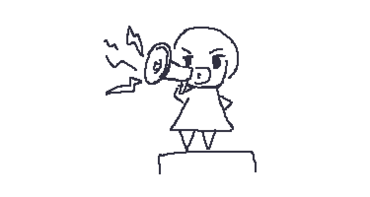
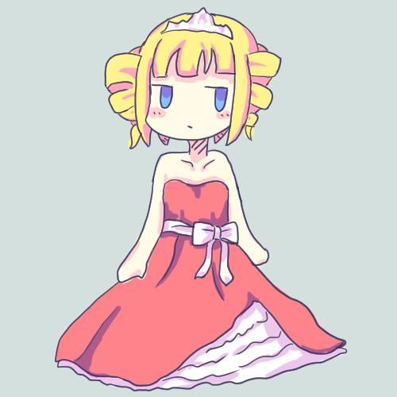
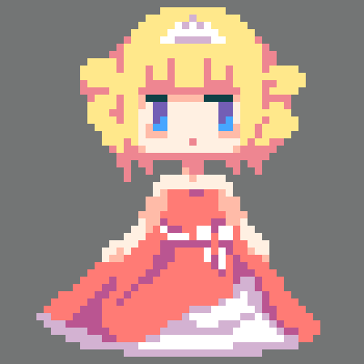
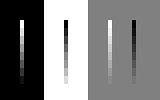

= 主張しすぎ主線

== 目的: 線画からドット絵を描く

主線（しゅせん、おもせん）は絵を描く上で重要な輪郭などを構成する主要な線のことです。主線を描画することで、対象の形状をはっきりと描くことができます。一般的に絵を描く上で、主線のみで構成された線画を綺麗に整えてから色を塗る、といった手法を取ることがよくあります。

ドット絵を描く場合においても、綺麗に線画を起こしてから色を塗っていく手法が用いられることがあります。別の方法として塗りからドット絵を描く方法もありますが、今回はドット絵線画を起こしてドット絵を描く方法で進めていきます。

今回のテーマとして、お姫様のドット絵を描いてみましょう。まずはドット絵の線画を描く前に、普通のイラストでおおざっぱなイメージを描いてみます。

さらに、このイメージを元に、ドット絵の線画を起こしてみます。下記のようになりました。

このドット絵線画に色を塗ってドット絵を仕上げてみましょう。あなたならどのように色を塗りあげるでしょうか？

== アンチパターンの例

ドット絵線画からドット絵を描く場合、主線を残しすぎてしまう場合がよくみられます。たとえば下記のようなものです。

image::images/pushy_initial_line_003_x8.png[主線を残しすぎたアンチパターン]

上記の絵はあなたにとってよい絵にみえるでしょうか？絵柄の問題ではあるので、もしかすると上のような主線を強く残した絵柄が好きな方もいるかもしれません。ただ、主線の主張が強すぎると絵に下記のような影響がでてくることでしょう。

細かい部分を描画するためのピクセルが不足する::
  解像度の低いドット絵では配置できるピクセルの数は限られており、貴重なものです。そこがただの主線だけで占められていると、単純に配置できるピクセルが少なくなってしまいます。使用できるピクセルが少なければ、それだけ表現の幅は狭まります。
主線の主張が強すぎて本来強調したい部分が強調されない::
  特に黒は人間の目にとって、たいへん主張が強い色です。特定の部分のみを強調したいときに適度に黒を使用するのは効果的ですが、どこでも黒い色で描画されていると、どこを強調したいのか伝わらなくなります。
主線の色がキャラクター本来の色に影響を与える::
  色は近傍の色に対して互いに影響を与え、近傍色が混じった色に見えるようになります。赤いピクセルの近傍は赤く、青いピクセルの近傍は青くみえます。これは錯視の一種で、色の同化と呼ばれる現象です。通常のデジタルイラストではピクセル単位での色の同化はあまり気になりませんが、解像度の低いドット絵においては特に顕著に現れます。特に黒は近傍色に与える影響が強く、黒の近傍色はより黒っぽくみえるようになります。当然ながら、ドット絵全体に黒いピクセルの比率が多ければ多いほど、ドット絵全体もまた黒っぽい印象になります。

どうして主線の存在がそこまで絵に影響をあたえるのでしょうか？それは、察しのいい方なら既にお気づきかと思いますが、解像度が低いことに起因します。主線と表記していますが、*主線には面積が存在します*。通常のイラストでは、主線が占める面積は小さいため影響も小さいですが、ドット絵は解像度が低いため主線の面積は無視できない大きさになります。

== アンチパターンの解決策

=== 主線の色トレス

主線の主張が強すぎる場合、色トレスと呼ばれる手法がよく用いられます。色トレスは、主線を近傍の塗り色に近い色で塗る手法です。たとえば、お姫様の絵を色トレスすると、下記のようになります。

上記の色トレス例では髪や肌の主線を茶色に、ドレスの主線を赤紫にしています。色トレスを行うと、主線が近くの色に馴染んで目立ちにくくなることがわかります。この色トレスの技法は、ドット絵だけではなくデジタルアート全般でよく用いられます。

NOTE: ここでいう色トレスはデジタルアートの分野でよく使われる意味の色トレスを指します。同じ表記でも、アニメーション業界における色トレスとは意味合いが異なるので注意してください。アニメーション業界での色トレスは、塗り分け用の色付きの主線の意味で使われることがあります。

ただし、色トレスを過度に行いすぎると、かえって絵全体の印象が弱まりすぎる場合があります。特にドット絵は色差を大きめにして、はっきりと色の違いを出したほうが映えることがよくあります。あなたが目指す絵柄や。描画する環境に応じて、主線の色の濃さや色トレスを行う箇所を工夫してみるとよいでしょう。

たとえば、ドット絵ではキャラクター全体の輪郭を強めたほうが映える場合がよくあります（たとえば、ゲーム用途で背景との差を強めたい場合など）。キャラクターの輪郭を強調したい場合は、全ての主線を色トレスするのではなく、外側輪郭の主線は内側の主線よりも色差の大きい色にしてみてもよいでしょう。

=== 主線の排除

主線の存在が絵に悪影響を与えるようであれば、不必要と思われる主線は排除していくのも一つの方法です。下書きの際に主線を描いていたとしても、最終的な絵として主線を残さなければいけないなどという決まりはありません。

たとえば、上記の色トレスしたお姫様のドット絵において、ドレスのしわの主線とその影色は色差が小さくほぼ同色です。しかも、このお姫様のドット絵において、ドレスのしわの主線はあまり強調する必要のない部分のように思えます。そのようなあまり意味のない主線は無理に残す必要はありません。代わりに、ドレスのしわの主線の代わりに陰色で塗り潰してみます。

主線が存在しなくとも、色差の大きい陰が描かれていれば、塗り色と陰色の色差によって対象の形状を表現することができます。主線は対象の境界を表現しますが、主線がなくとも色と色の差そのものが境界となります。また、ドット絵のように限られた解像度の中で描く場合は、陰を描く領域として1、2ピクセル程度しか使用できないこともよくあります。そのような細い陰は*主線でもあり陰色でもある*両方の役割を担うピクセルと考えることもできるでしょう。

基本的には、印象を強めたい箇所は色差の大きい主線で描き、逆に印象を強める必要がない部分は色差の小さな主線にするか主線を描かない選択をすることになるでしょう。部位によって印象の強さを調整することは、ドット絵の絵柄に大きく影響します。

たとえば、主線をほとんど取り除いて描く絵柄もあります（肌色や黄色は白背景だと目立たなくなるので、濃い色の背景にしています）。

=== 色で主線の強弱を変える

色トレスと似たような話なのですが、少し違う視点から主線の強弱を変化させる方法を考えてみます。

一般的なイラストでは、線の強弱を線の太さによって変える場合があります。細い線は弱く見えるし、太い線は強く見えます。しかし、解像度の限られたドット絵においては、思い通りに線を細くしたり、太くできない状況がよくあります。1ピクセルより細い線は描けないし、2ピクセル線にすると太すぎる…といった具合です。

線の実際のサイズは変えられないけれど、線を細く見せたり太く見せるにはどうすればよいでしょうか？そう、色を変えればよいのです。

上記の図は1ピクセルの均一な太さの線ですが、周りの色と比べて色差の小さなピクセルは細く、逆に色差の大きいピクセルは太く見えるようになります。当然、細く見える線は弱く、太く見える線は強く感じられることになります。つまり、1ピクセルの線しか引けない状況であったとしても、色を変えることでその線の見た目上の太さ強さを調整することができるのです（線の強弱が変化するからこそ、見た目上の太さが変化するように感じられるともいえます）。線の色に変化をつけることで、線の強弱が変わり、絵全体の雰囲気も変わるので、強弱の付け方をいろいろ変えてみると楽しいかもしれません。

== アンチパターンを用いても良い場合

=== 解像度が十分に高い

このアンチパターンは解像度が低ければ低いほどより顕著に現れます。逆に言えば、解像度が十分に高いドット絵であれば、主線を残したままの絵柄でも描きやすいはずです。解像度が高ければ、主線の強弱を色だけではなく実際の線の太さでつけることもより容易となることでしょう。
