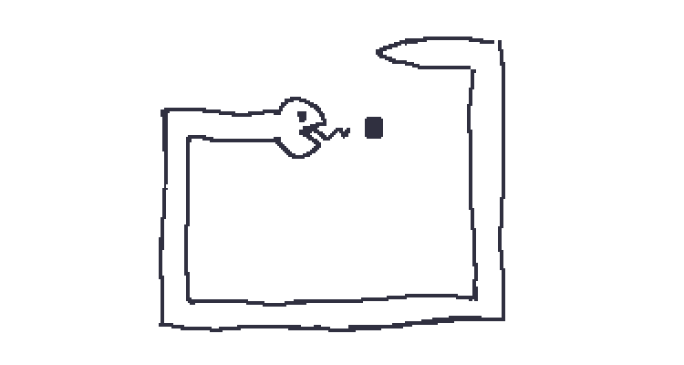
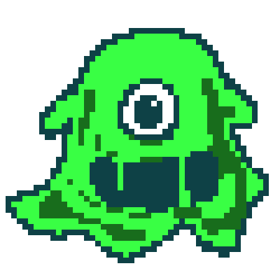
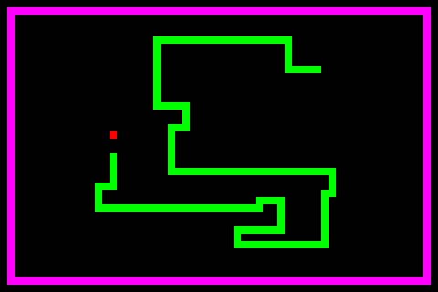
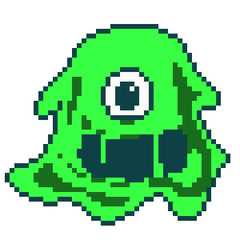
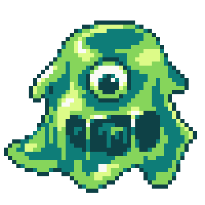

= ヘビゲーム

== 目的: 曲線を描く

ドット絵はエディタ上で1ピクセルごとに打つものだと思っている人もいるかもしれませんが、そんなことはありません。細かい部分を調整する場合は1ピクセル毎に打つこともありますが、それは絵が十分に出来上がってきた段階ですることです。大抵の場合、ドット絵でも下書きから描くのがほとんどでしょう。

今回は下記のようなスライムのドット絵を描いてみましょう。ドット絵エディタで線の設定を太さ1ピクセルにして、フリーハンドで下書きをかいていきます。スライムは不定形のものなので、うねうねと曲線を描くことになるでしょう。

== アンチパターンの例

ドット絵エディタで線の設定を太さ1ピクセルにして描けば、それで1ピクセルの線となると思えるかもしれません。ドット絵初心者の描くドット絵にはよくありがちで、この下書きのような線のまま色を付けてたようなドット絵をよく見かけます。

しかし、上記のようなフリーハンドで描いた線はドット絵としてはそのまま綺麗な線にはなりません。

NOTE: ここでは一般的なドット絵エディタにおける太さ1ピクセルのフリーハンド線での下書きを想定しています。ただし、ドット絵エディタによっては、フリーハンドでもある程度綺麗な1ピクセルの線となるように補正する機能を持つものもあります。

ところで、読者はlink:https://ja.wikipedia.org/wiki/%E3%83%98%E3%83%93%E3%82%B2%E3%83%BC%E3%83%A0[ヘビゲーム（Snake）]をご存知でしょうか？おそらく、知っているひとはそれなりの年齢かと思いますが、簡単に言うと下記のようなヘビを操作するゲームです。エサを食べることが目的ですが、エサを食べるとヘビの体が伸び、下手に動くと自分の体にぶつかってしまいます。自分の体にぶつかるとゲームオーバーになります。

ここで注目して欲しいのはヘビが曲がった時の描かれかたです。ヘビゲームのヘビは上下左右に曲がるのですが、このヘビもまた低解像度のピクセルの世界に行きているせいか、直角にしか曲がることが出来ません。そのため、曲がった部分はピクセルとピクセルが常に隣接した状態になっています。

通常のドット絵エディタのフリーハンドで描いた1ピクセル線も、ヘビのように曲線部がピクセルとピクセルが隣接した状態になる場合がほとんどです。このように、曲線のピクセルが隣接した状態になっていると、どうしても曲線のはずなのにガタガタした見た目になってしまいます。

== アンチパターンの解決策

=== ピクセルを隣接させない

ドット絵において1ピクセルの曲線を描く時、基本的に曲がった場所でピクセルは隣接させないようにします。下書き状態のスライムをもとに、余分な隣接ピクセルを取り除いてみると下記のようになります。

上記のスライムに色を塗ってみましょう。

最初の例に比べて、外周のガタガタした感じが薄まっていることがわかります。

ちなみに、上記は初心者っぽい塗りのままにしていますが、本節のアンチパターン以外にも色々と改善して塗ると、よりよいドット絵になることでしょう（今後のアンチパターンの事例から、どのようになおせばよいのか学べることでしょう）

== アンチパターンを用いても良い場合

=== 意図的にガタガタした曲線を描く

絵柄としてガタガタした曲線にしたい場合、このような描き方を選択する場合もあるかもしれません。たとえば、ガタガタした曲線にすると、まだドット絵が発展していない黎明期のレトロゲームっぽい絵柄にもなるかもしれません。
