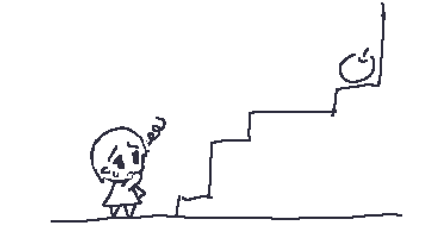
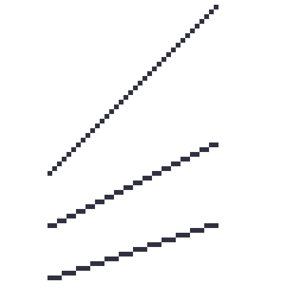
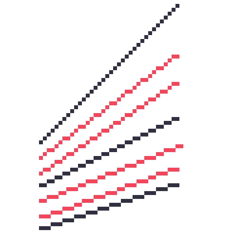
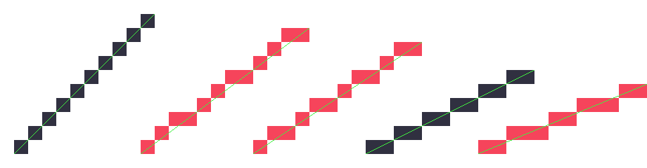
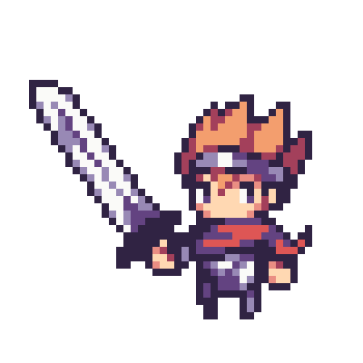
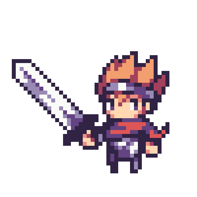
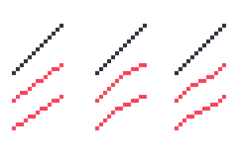
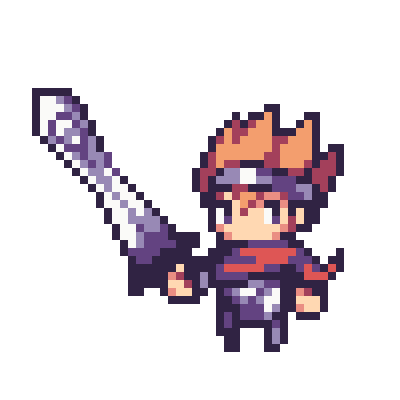

= ふぞろいの段差たち

== 目的: 半端な角度の線を描く

ドット絵はピクセルによって構成されています。そのため、線を描くときもピクセルの集まりで描きます。たとえば、次のとおりです。

上記のポイントは「1・1・1」「2・2・2」のように同じ数のピクセルを繋げて配置していることです。同じ数のピクセルを並べることで、綺麗な線にみえます。「1・1・1」なら45°、「2・2・2」なら約26.6°の角度の直線（の近似）となります。

NOTE: 線分の角度 $$ \theta $$ は、線分の幅を$$ a $$、高さを $$ b $$ としたとき $$ \theta = \arctan \frac{b}{a} $$となります。たとえば、上記「2・2・2」線の場合は、高さ1ピクセルに対し、幅2ピクセルの線分なので、下記のように計算できます。
$$
\arctan \frac{1}{2} \fallingdotseq 0.46\,rad \fallingdotseq 26.6^\circ
$$
link:https://www.google.co.jp/search?q=arctan%281%2F2%29+in+degrees[Googleなどで計算することもできます。]

しかし、この方法だけでは「1・1・1」と「2・2・2」の中間となる半端な角度を描くことができません。どのようにすればよいでしょうか？

== アンチパターンの例

半端な角度の斜線を描く際に、ピクセルの並びを「1・1・2・1・1」「1・2・1・2」「2・3・2・3」などピクセル数を周期的に増減させて描きます。

しかし、このような周期ピクセル線は「1・1・1」「2・2・2」のような同じ数のピクセル線と比較して綺麗な線とはなりません。特に「1・1・2・1・1」「1・2・1・2」のような1ピクセルと2ピクセルで構成された線ではガタガタさがより顕著です。どうしてこのようにガタガタしてしまうのでしょうか？

ガタガタさをよりわかりやすくするため、それぞれの線を拡大し、本来描きたい線を緑色の補助線として引いてみましょう。

赤い線（周期ピクセル線）と緑色の線を比べると、線がずれていることがわかります。つまり、本来描きたい角度の線との誤差が大きいということです。これが、ガタガタしてみえる原因です。このような線が含まれていると、絵を見た人は絵そのものがガタガタしているという印象をもってしまうかもしれません。

例として周期ピクセル線を実際に用いたドット絵をみてみましょう。下記の絵は剣の部分が周期ピクセル線で描かれています。描いた人は直剣のつもりかもしれませんが、どうしてもガタガタした剣にみえてしまいます。

では、この誤差を小さくすることはできるでしょうか？残念ながら、単色の1ピクセル線においてこれ以上本来の線との誤差を小さくすることはできません。これは、ドット絵というものが限られた解像度の上で成り立っている以上、避けられないことです。

半端な角度の線において、本来の線との誤差が最小となる、すなわち本来の線に最も近いのが「1・1・2・1・1」などの周期ピクセル線といえます。たとえ、見た目がガタガタであったとしても、理論上はこれがもっとも正しい線のように思えるかもしれません。

NOTE: 多くのグラフィックソフトでは、直線を描画するためのツールが実装されています。ソフトウェア上、アンチエイリアスなしの直線を描く場合、link:https://ja.wikipedia.org/wiki/%E3%83%96%E3%83%AC%E3%82%BC%E3%83%B3%E3%83%8F%E3%83%A0%E3%81%AE%E3%82%A2%E3%83%AB%E3%82%B4%E3%83%AA%E3%82%BA%E3%83%A0[ブレゼンハムのアルゴリズム]が最もよく利用されています。ブレゼンハムのアルゴリズムは、本来の線との誤差を小さく描画する方法なので、角度によっては上記のような周期ピクセル線によって描画されます。

== アンチパターンの解決策

=== そもそも半端な角度の線は描かない

「1・2・1・2」などの周期ピクセル線は見た目が美しくありません。ですが、そもそも描画しにくい角度の線を必要としない構図にすれば、そのようなことを考える必要はありません。

たとえば、このキャラクターが剣の角度を45°に持つと呪いにより舌を噛み切って自害する設定があるなら、45°では持たせられないでしょう。そうでなければ、単純にドット絵で描きやすい角度のデザインや構図にするのが懸命でしょう。ドット絵で映えるように描いてあげるのがよい選択肢です。

=== ゆるやかな曲線で代替する

「1・2・1・2」だと綺麗に描くことはできません。もし始点と終点が同じでさえあれば良いのであれば、「1・1」と「2・2」線の組み合わせで描いてもよいことになります。ピクセル数が均等な線で構成されていれば、全体的に線は綺麗に見えます。

上記のように描く場合、直線を描いているのではなくゆるやかな曲線を描いているといえます。本来の線との誤差は大きくなりますが、その代わり見た目上のガタガタを抑えることができます。

あなたが本当に必要だったものは、本当に直線だったのでしょうか？実は、ゆるやかな曲線で描画したほうが結果的に綺麗に見るものではないでしょうか？よく検討してみてください。

たとえば、単純に直線な剣ではなく、ゆるやかな曲線を取り入れた剣でもよいかもしれません。

== アンチパターンを用いても良い場合

=== 複雑な形状

実際のところ、ドット絵を描くにあたって綺麗な線ばかりで構成されたものというのはそう多くはないでしょう。たいていの事物は複雑な形で構成されているものです。そのため、描く対象によっては、綺麗になり過ぎないように描いてあげたほうが、それらしい見た目になることも多いことでしょう。

たとえば、人間であれば手があり足があり、その上に服があり装飾品があり……と、様々なものの複雑な組み合わせで構成されていることがほとんどです。複雑な要素を描くために、複雑な線にせざるを得ないことはよくあることでしょう。また、人間の足を綺麗な線だけで描きすぎると、無機質でロボットのような見た目になってしまうかもしれません。もしあなたが人間らしい膨らみをドット絵の中で表現したい場合、綺麗な線を意図的に崩すことも検討するのがよいでしょう。もちろん、あえて直線的な絵柄にしたいのであれば、それはそれでよいものだと思います（あなたがそう意図しているならば）。

ただし、機械のように、直線的なイメージの強い事物を描く場合は、やはりまず半端な角度を必要としないような構図を心がけましょう。どうしても必要な場合のみ周期ピクセル線を使うようにするべきです。そうすれば、綺麗な仕上がりとなることでしょう。

=== ガタガタした絵柄

もしかすると、あなたがあえて意図的にガタガタしている、というような印象を見た人に与えたい場合もあるかもしれません。そうであれば、周期ピクセル線を積極的に取り入れたドット絵を描くというのも、それはそれでおもしろいかもしれません。
